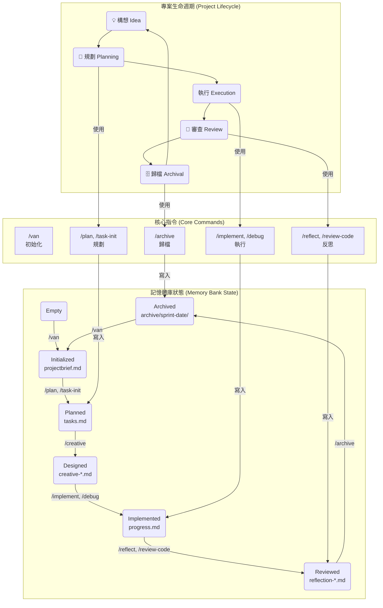

# ⭐ Agentic Coding Framework

**告別 AI 的金魚腦！這是一套為 Cursor IDE 量身打造的、結構化的 AI 協作開發框架。**

本框架旨在解決 AI 在大型專案中「說過就忘」、「缺乏規劃」、「無法遵循團隊規範」的核心痛點。它將您的 AI 助手從一個 stateless 的問答機器，升級為一個有記憶、有原則、有思想的**專案核心成員**。

## 🚀 Cursor 導入與使用：開啟智能協作之旅

為了最大化本框架的效能，建議您將本專案導入 [Cursor IDE](https://www.cursor.sh/)。Cursor IDE 提供原生支持自訂斜線指令（Custom Slash Commands）和規則（Rules）的環境，讓 AI Agent 得以完美運行。

### 步驟指引：

1.  **克隆專案:**
    首先，請將本專案克隆到您的本地電腦：
    ```bash
    git clone https://github.com/Zenobia000/cursor-agentic-coding-template.git
    ```
2.  **使用 Cursor 開啟專案:**
    開啟 Cursor IDE，然後選擇 `File > Open Folder` (或 `Open Project`)，導航至您剛才克隆的 `cursor-agentic-coding-template` 目錄並開啟它。
3.  **確認指令啟用:**
    一旦專案在 Cursor 中開啟，您可以在 Cursor 的 AI Chat 中輸入 `/`，應該會看到本框架提供的所有自訂指令列表（例如 `/van`, `/plan` 等）。如果沒有看到，請檢查 Cursor 版本是否為最新，並確保自訂指令功能已啟用。
4.  **開始您的第一個任務:**
    在 Cursor 的 AI Chat 中輸入 `/van`，啟動專案初始化流程，AI Agent 會引導您完成後續設置。

---

## 🚀 核心價值：打造您的專屬 AI 開發團隊

使用本框架，您可以：
-   **💡 賦予 AI 長期記憶:** AI 能在數天、數週的開發週期中，始終記得專案的目標、任務、設計決策和技術選型。
-   **📜 建立 AI 的行為準則:** 透過可配置的規則引擎，讓 AI 的每一次程式碼提交都嚴格遵循您的團隊規範。
-   **🤖 實現人機無縫協作:** AI Agent 與人類開發者在同一個「共享大腦」 (`memory-bank`) 上工作，資訊完全同步。
-   **🧠 培養 AI 的批判性思維:** 在執行每個動作前，AI 都會先進行「健康檢查」，確保輸入的完整性和合理性，而不是盲目執行。

---

## 🏛️ 知識建構體系：三大支柱

本框架的靈魂在於其「知識建構體系」，它由三大支柱構成，協同工作，在專案的整個生命週期中不斷地建構、提煉和傳承知識。

1.  **指令 (Commands): AI 的「行動能力」**
    -   位於 `.cursor/commands/`，是 AI 可以執行的所有開發動作（如 `/plan`, `/implement`）。
    -   每個指令都內置了「健康檢查」和「記憶體互動」協議，確保每一次行動都安全、可靠、可追溯。

2.  **記憶體庫 (Memory Bank): AI 的「共享大腦」**
    -   位於 `memory-bank/`，是專案的唯一真相來源 (Single Source of Truth)。
    -   透過 `current/` 工作區實現週期隔離，透過 `schemas/` 定義數據契約，透過 `archive/` 實現知識的永久存檔。AI 的所有工作成果最終都會沉澱於此。

3.  **規則引擎 (Rules Engine): AI 的「行為憲法」**
    -   位於 `.cursor/rules/`，是指導 AI 行為的原則和規範。
    -   透過清晰的分類和 `README.md` 索引，您可以輕鬆地為 AI 配置團隊的編碼風格、Git 工作流和架構原則。

---

## 🌊 專案生命週期與工作流

下圖完整展示了本框架的運作模式：一個指令如何驅動記憶體庫狀態的變遷。



---

## 📖 指令功能速查表 (Command Cheatsheet)

| 指令 (Command) | 核心功能 | 使用時機 |
| :--- | :--- | :--- |
| **`/van`** | **初始化工作區** | 每個新專案或新週期的開始。 |
| **`/task-init`** | **創建 Epic 任務** | 當你有一個新的、高層次的想法時。 |
| **`/plan`** | **詳細任務分解** | 將一個 Epic 分解為可執行的子任務。 |
| **`/task-next`** | **PM 助理簡報** | 當你不確定下一步做什麼時，獲取策略性建議。 |
| **`/creative`** | **技術設計與決策** | 在編碼前，為複雜任務進行架構設計。 |
| **`/implement`** | **TDD 編碼實現** | 根據設計文檔，以測試驅動的方式編寫程式碼。 |
| **`/write-tests`** | **補全測試** | 為現有程式碼補充單元、整合或 E2E 測試。 |
| **`/debug`** | **除錯** | 當遇到 Bug 時，進行系統化的根本原因分析與修復。 |
| **`/review-code`** | **程式碼審查** | 對一段程式碼變更進行有重點的、基於規則的審查。 |
| **`/optimize-performance`** | **效能優化** | 當遇到效能瓶頸時，進行數據驅動的優化。 |
| **`/reflect`** | **復盤與反思** | 在一個開發週期結束後，總結經驗教訓。 |
| **`/archive`** | **歸檔週期** | 將當前週期的所有記憶歸檔，並清理工作區。 |

## 快速上手 (Quick Start)

1.  **初始化專案:** 在聊天框中輸入 `/van`，AI 會為您創建好整個記憶體結構。
2.  **定義專案:** 根據提示，填寫 `memory-bank/current/projectbrief.md`，告訴 AI 您的宏偉藍圖。
3.  **開始規劃:** 輸入 `/plan`，AI 會將您的藍圖分解為詳細的任務列表。
4.  **迭代開發:** 使用 `/creative`, `/implement`, `/debug` 等指令，與您的 AI 夥伴一起，享受這段全新的開發旅程吧！
