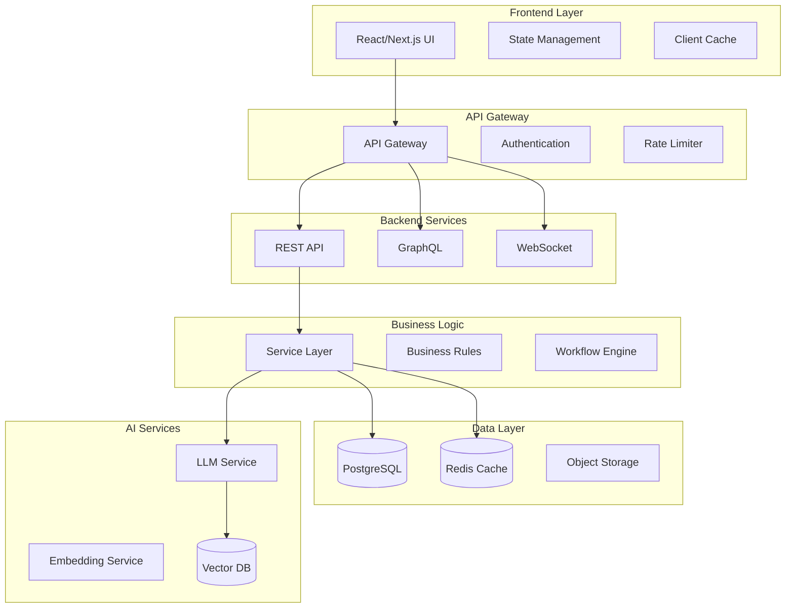

# 🏰 系統架構模式

## 🗺️ 整體架構

### 系統架構圖


## 🏗️ 架構決策記錄 (ADR)

### ADR-001: 微服務 vs 單體架構
- **日期**: 2024-01-01
- **狀態**: 已採用
- **決策**: 採用模組化單體架構
- **原因**:
  - 團隊規模適中
  - 降低運維複雜度
  - 保持未來拆分彈性
- **後果**:
  - ✅ 開發速度快
  - ✅ 部署簡單
  - ⚠️ 需要良好的模組邊界

### ADR-002: 資料庫選擇
- **日期**: 2024-01-05
- **狀態**: 已採用
- **決策**: PostgreSQL 作為主資料庫
- **原因**:
  - ACID 合規性
  - JSON 支援
  - 全文搜尋能力
  - 豐富的擴展
- **替代方案**:
  - MongoDB (文檔彈性但缺乏 ACID)
  - MySQL (功能較少)

### ADR-003: 前端框架
- **日期**: 2024-01-10
- **狀態**: 已採用
- **決策**: Next.js 14 with App Router
- **原因**:
  - Server Components 效能
  - 內建優化
  - TypeScript 支援
  - 生態系統成熟

## 🔧 設計模式

### 1. Repository Pattern (資料存取層)
```typescript
// 介面定義
interface IUserRepository {
  findById(id: string): Promise<User | null>
  findByEmail(email: string): Promise<User | null>
  create(data: CreateUserDto): Promise<User>
  update(id: string, data: UpdateUserDto): Promise<User>
  delete(id: string): Promise<boolean>
}

// 實作
class UserRepository implements IUserRepository {
  constructor(private db: DatabaseConnection) {}

  async findById(id: string) {
    return this.db.user.findUnique({ where: { id } })
  }

  // ... 其他方法實作
}
```

### 2. Service Layer Pattern (業務邏輯)
```typescript
class UserService {
  constructor(
    private userRepo: IUserRepository,
    private emailService: IEmailService,
    private cacheService: ICacheService
  ) {}

  async createUser(data: CreateUserDto) {
    // 業務規則驗證
    const existingUser = await this.userRepo.findByEmail(data.email)
    if (existingUser) {
      throw new ConflictError('Email already exists')
    }

    // 創建用戶
    const user = await this.userRepo.create(data)

    // 發送歡迎郵件
    await this.emailService.sendWelcome(user.email)

    // 更新快取
    await this.cacheService.set(`user:${user.id}`, user)

    return user
  }
}
```

### 3. Factory Pattern (物件創建)
```typescript
abstract class NotificationFactory {
  abstract createNotification(type: string): INotification
}

class NotificationFactoryImpl extends NotificationFactory {
  createNotification(type: string): INotification {
    switch(type) {
      case 'email':
        return new EmailNotification()
      case 'sms':
        return new SmsNotification()
      case 'push':
        return new PushNotification()
      default:
        throw new Error(`Unknown notification type: ${type}`)
    }
  }
}
```

### 4. Observer Pattern (事件驅動)
```typescript
class EventEmitter {
  private events: Map<string, Function[]> = new Map()

  on(event: string, callback: Function) {
    if (!this.events.has(event)) {
      this.events.set(event, [])
    }
    this.events.get(event)!.push(callback)
  }

  emit(event: string, ...args: any[]) {
    const callbacks = this.events.get(event)
    if (callbacks) {
      callbacks.forEach(cb => cb(...args))
    }
  }
}

// 使用
const emitter = new EventEmitter()
emitter.on('user.created', async (user) => {
  await sendWelcomeEmail(user)
  await updateAnalytics(user)
})
```

## 🎯 架構原則

### SOLID 原則
1. **Single Responsibility**: 每個模組只負責一件事
2. **Open/Closed**: 對擴展開放，對修改關閉
3. **Liskov Substitution**: 子類型必須能替換父類型
4. **Interface Segregation**: 細粒度的介面
5. **Dependency Inversion**: 依賴抽象而非具體實作

### DRY (Don't Repeat Yourself)
- 共用邏輯抽取到 utility 函數
- 使用組合而非繼承
- 配置集中管理

### KISS (Keep It Simple, Stupid)
- 避免過度工程
- 優先使用簡單解決方案
- 程式碼可讀性優先

## 🔄 資料流設計

### 單向資料流
```
User Action → Dispatch → Reducer → State → View
                ↑                      ↓
                └── Side Effects ←─────┘
```

### Event Sourcing
```typescript
interface Event {
  id: string
  type: string
  aggregateId: string
  data: any
  timestamp: Date
  version: number
}

class EventStore {
  async append(event: Event): Promise<void> {
    // 儲存事件
    await this.db.events.create({ data: event })

    // 發布事件
    await this.publisher.publish(event)
  }

  async getEvents(aggregateId: string): Promise<Event[]> {
    return this.db.events.findMany({
      where: { aggregateId },
      orderBy: { version: 'asc' }
    })
  }
}
```

## 🛡️ 安全架構

### 分層安全
1. **網路層**: WAF、DDoS 防護
2. **應用層**: 認證、授權、輸入驗證
3. **資料層**: 加密、存取控制
4. **基礎設施**: 容器安全、密鑰管理

### Zero Trust 架構
- 永不信任，始終驗證
- 最小權限原則
- 微分段
- 持續監控

## 📈 擴展性設計

### 水平擴展策略
```yaml
# Load Balancer 配置
upstream:
  - server1:3000 weight=1
  - server2:3000 weight=1
  - server3:3000 weight=1

# 會話親和性
session_affinity: ip_hash

# 健康檢查
health_check:
  interval: 10s
  timeout: 3s
  unhealthy_threshold: 3
```

### 快取策略
```typescript
// 多層快取
class CacheManager {
  constructor(
    private l1Cache: MemoryCache,    // 記憶體快取
    private l2Cache: RedisCache,     // Redis 快取
    private l3Cache: CDNCache        // CDN 快取
  ) {}

  async get(key: string): Promise<any> {
    // L1 查詢
    let value = await this.l1Cache.get(key)
    if (value) return value

    // L2 查詢
    value = await this.l2Cache.get(key)
    if (value) {
      await this.l1Cache.set(key, value)
      return value
    }

    // L3 查詢
    value = await this.l3Cache.get(key)
    if (value) {
      await this.l2Cache.set(key, value)
      await this.l1Cache.set(key, value)
      return value
    }

    return null
  }
}
```

## 🔍 監控與可觀測性

### 三大支柱
1. **Logging**: 結構化日誌
2. **Metrics**: 系統指標
3. **Tracing**: 分散式追蹤

### 監控架構
```typescript
// OpenTelemetry 整合
import { trace, metrics } from '@opentelemetry/api'

const tracer = trace.getTracer('app-name')
const meter = metrics.getMeter('app-name')

// 請求計數器
const requestCounter = meter.createCounter('http_requests_total')

// 請求追蹤
function traceRequest(req, res, next) {
  const span = tracer.startSpan('http_request')

  span.setAttributes({
    'http.method': req.method,
    'http.url': req.url
  })

  res.on('finish', () => {
    span.setAttributes({
      'http.status_code': res.statusCode
    })
    span.end()

    requestCounter.add(1, {
      method: req.method,
      status: res.statusCode
    })
  })

  next()
}
```

## 📋 技術債務追蹤

### 當前技術債務
1. **高優先級**
   - [ ] 資料庫查詢優化
   - [ ] 前端 Bundle 大小優化

2. **中優先級**
   - [ ] 測試覆蓋率提升
   - [ ] 文檔更新

3. **低優先級**
   - [ ] 程式碼風格統一
   - [ ] 棄用套件升級

### 償還計劃
- 每個 Sprint 分配 20% 時間處理技術債務
- 定期技術債務審查會議
- 建立技術債務預算

---

**最後更新**: 2024-12-17
**維護者**: 架構團隊