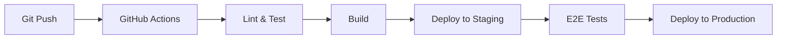

# 🛠️ 技術架構

## 🎨 前端技術棧

### 框架與函式庫
- **框架**: Next.js 14 (App Router)
- **UI 元件**: React 18
- **樣式**: Tailwind CSS + CSS Modules
- **狀態管理**: Zustand / Jotai
- **表單處理**: React Hook Form + Zod
- **資料擷取**: TanStack Query / SWR

### 開發工具
- **打包工具**: Turbopack / Webpack
- **程式碼檢查**: ESLint + Prettier
- **型別檢查**: TypeScript 5.x
- **測試**: Jest + React Testing Library

## ⚙️ 後端技術棧

### 主要技術
- **執行環境**: Node.js 20 LTS
- **框架**: Express / Fastify / NestJS
- **API 風格**: RESTful + GraphQL (optional)
- **資料庫**: PostgreSQL + Redis
- **ORM**: Prisma / TypeORM

### 基礎設施
- **容器化**: Docker + Docker Compose
- **反向代理**: Nginx
- **快取**: Redis
- **佇列**: Bull / BullMQ

## 🤖 AI 技術棧

### LLM 提供者
- **主要**: OpenAI GPT-4
- **備用**: Claude 3 / Gemini Pro
- **本地**: Ollama (開發環境)

### AI 框架
- **Agent Framework**: LangChain / LlamaIndex
- **向量資料庫**: Pinecone / Weaviate / Qdrant
- **Embedding**: OpenAI text-embedding-3

## 🚀 部署架構

### 環境配置
```yaml
Development:
  - Local development server
  - Hot reload enabled
  - Debug mode on

Staging:
  - Docker containers
  - Similar to production
  - Test data

Production:
  - Cloud provider (AWS/GCP/Azure)
  - Load balancer
  - Auto-scaling
  - CDN for static assets
```

### CI/CD Pipeline


## 📦 主要相依套件

### 前端相依
```json
{
  "next": "^14.0.0",
  "react": "^18.2.0",
  "typescript": "^5.3.0",
  "tailwindcss": "^3.4.0",
  "@tanstack/react-query": "^5.0.0"
}
```

### 後端相依
```json
{
  "express": "^4.18.0",
  "prisma": "^5.0.0",
  "@prisma/client": "^5.0.0",
  "jsonwebtoken": "^9.0.0",
  "bcryptjs": "^2.4.0"
}
```

### AI 相依
```json
{
  "langchain": "^0.1.0",
  "openai": "^4.0.0",
  "@pinecone-database/pinecone": "^1.0.0"
}
```

## 🔧 開發環境設定

### 必要工具
- Node.js 20+
- pnpm / yarn / npm
- Docker Desktop
- Git

### 環境變數
```env
# Application
NODE_ENV=development
PORT=3000

# Database
DATABASE_URL=postgresql://...
REDIS_URL=redis://...

# API Keys
OPENAI_API_KEY=sk-...
PINECONE_API_KEY=...

# Authentication
JWT_SECRET=...
REFRESH_TOKEN_SECRET=...
```

## 📐 架構決策記錄 (ADR)

### ADR-001: 選擇 Next.js
- **日期**: 2024-XX-XX
- **決策**: 使用 Next.js 作為前端框架
- **原因**: SSR/SSG 支援、優秀的 DX、完整生態系

### ADR-002: 選擇 PostgreSQL
- **日期**: 2024-XX-XX
- **決策**: 使用 PostgreSQL 作為主要資料庫
- **原因**: ACID 合規、豐富功能、成熟穩定

[更多 ADR...]

## 🔄 版本資訊
- **Node.js**: 20.x LTS
- **npm/pnpm**: 9.x / 8.x
- **Docker**: 24.x
- **專案版本**: 1.0.0